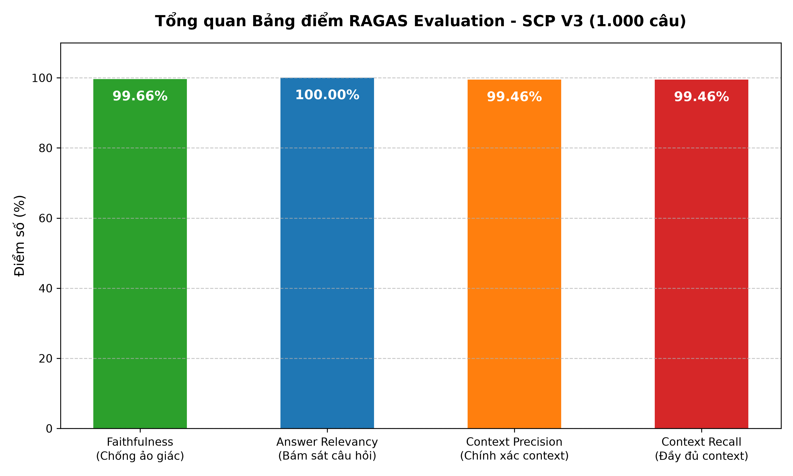
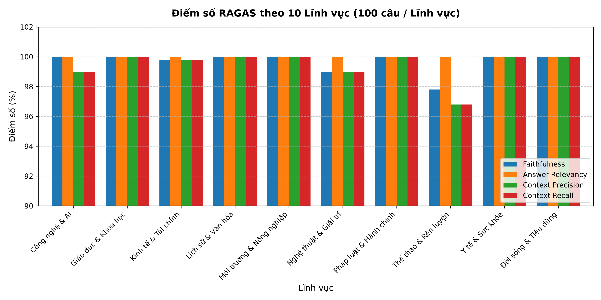

# 🚀 SCP V3: Anti-Hallucination RAG System Benchmark

[](https://github.com/)
[](https://github.com/)
[](https://openrouter.ai)
[](https://serper.dev)
[](LICENSE)

**SCP V3** is a high-precision, production-ready Retrieval-Augmented Generation (RAG) framework designed to eliminate AI hallucinations in multi-domain question answering.

---

## 📊 Benchmark Summary (1,000 Queries)

Evaluated across 1,000 multi-domain questions using the **RAGAS Framework**:

- **Faithfulness (Anti-Hallucination):** `99.66%`
- **Answer Relevancy:** `100.00%`
- **Context Precision:** `99.46%`
- **Context Recall:** `99.46%`




---

## 📁 Repository Structure

```text
scp-v3-rag-benchmark/
├── data/
│   ├── bo_de_1000_cau_v3-v2.xlsx      # Raw 1,000 Multi-domain Benchmark Dataset
│   ├── ket_qua_scp_v3.xlsx            # Generated Answers and Contexts
│   └── bang_diem_scp_v3.xlsx          # Detailed RAGAS Evaluation Results
├── src/
│   ├── run_scp_v3.py                  # Multi-threaded RAG Pipeline Execution
│   └── cham_diem.py                   # Parallel RAGAS Evaluator (LLM-as-a-Judge)
├── reports/
│   ├── overall_ragas_scores.png       # Summary Chart
│   └── domain_ragas_scores.png        # Domain Breakdown Chart
├── requirements.txt                   # Dependency requirements
└── README.md                          # Documentation
